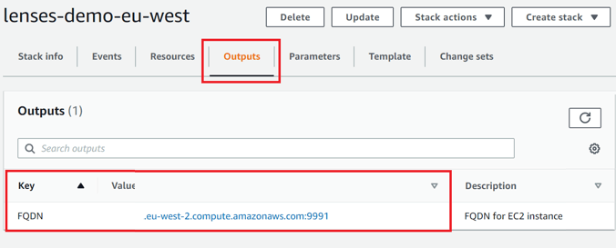

// Add steps as necessary for accessing the software, post-configuration, and testing. Don’t include full usage instructions for your software, but add links to your product documentation for that information.
//Should any sections not be applicable, remove them

== Post-deployment steps

. Copy the URL of the Lenses workspace in CloudFormation Outputs shown in <<outputs1>> and <<outputs2>>.
. Use the instance ID as the password to login in Lenses workspace. Specifically *admin/<ec2-instance-id>*

:xrefstyle: short
[#outputs1]
.LensesWorkspace URL
[link=images/cfn_outputs.png]

:xrefstyle: short
[#outputs2]
.Lenses Password
[link=images/instance-name.png]
image::../images/instance-name.png[EC2InstanceIDLensesPassword,width=80%,height=80%]

== Security
// Provide post-deployment best practices for using the technology on AWS, including considerations such as migrating data, backups, ensuring high performance, high availability, etc. Link to software documentation for detailed information.

The EC2 instance doesn't use SSH key pairs but it supports EC2 Instance Connect as it is a secure way to use AWS Identity and Access Management (IAM) policies and principals to control SSH access to your instances, removing the need to share and manage SSH keys. 
You can find more details at https://docs.aws.amazon.com/AWSEC2/latest/UserGuide/Connect-using-EC2-Instance-Connect.html