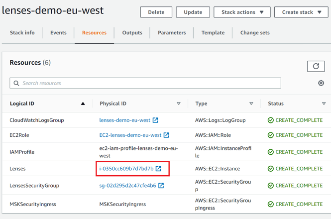

// Add steps as necessary for accessing the software, post-configuration, and testing. Don’t include full usage instructions for your software, but add links to your product documentation for that information.
//Should any sections not be applicable, remove them

== Post-deployment steps
=== Lenses workspace URL and login credentials
:xrefstyle: short
To log in to the Lenses workspace, use `admin` as the user name. The URL of the Lenses workspace and the password can be found in the https://console.aws.amazon.com/cloudformation/home?region=us-east-1#/[AWS CloudFormation console]. 

* URL
+
On the *Outputs* tab, find the URL of the Lenses workspace in the *Value* column of the *FQDN* key row. In the example shown in <<outputs1>>, the URL is `.eu-west-2-compute.amazonaws.com:9991`.
+
[#outputs1]
.Lenses workspace URL
[link=images/cfn_outputs.png]

* Password
+
On the *Resources* tab, find the password in the *Physical ID* column of *Logical ID* row for *Lenses*. In the example shown in <<outputs2>>, the password is `i-0350cc609b7d7bd7b`.
+
:xrefstyle: short
[#outputs2]
.Lenses password
[link=images/instance-name.png]

== Security
// Provide post-deployment best practices for using the technology on AWS, including considerations such as migrating data, backups, ensuring high performance, high availability, etc. Link to software documentation for detailed information.

The EC2 instance deployed by this Quick Start supports Amazon EC2 Instance Connect. With EC2 Instance Connect, you use AWS Identity and Access Management (IAM) policies and principals to control SSH (Secure Shell) access to your instances, removing the need to share and manage SSH keys. For more information, see https://docs.aws.amazon.com/AWSEC2/latest/UserGuide/Connect-using-EC2-Instance-Connect.html[Connect to your Linux instance using EC2 Instance Connect^].