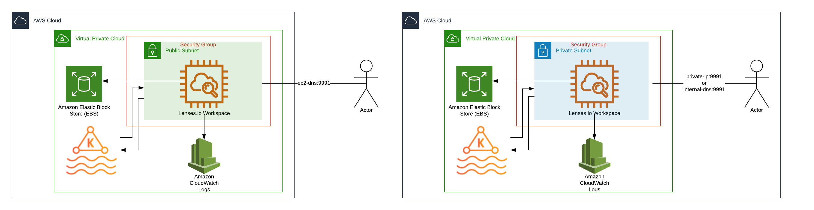

:xrefstyle: short

<<architecture1>> shows all the components the Quick Start may deploy. Resources are created according to the deployment when launching the AWS CloudFormation template.

:xrefstyle: short
[#architecture1]
.Quick Start architecture for Lenses.io on AWS with Managed Streaming Kafka in public or private subnet
[link=images/architecture_diagram.png]

As shown in <<architecture1>>, this deployment sets up the following, which constitutes the Lenses.io workspace in your AWS account:

* A Managed Streaming for Apache Kafka (MSK) cluster.
* An EC2 Instance with your selected instance type.
* A security group to access the Lenses.io workspace and setup the rule for communicating
with Amazon MSK.
* A Cloudwatch log group where you can see the Lenses.io workspace logs.
* An Elastic Block Storage (EBS) volume where the data is stored if you select the local storage option (default) when deploying the Quick Start.