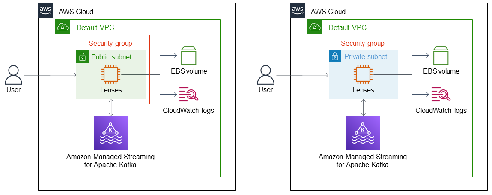

:xrefstyle: short

<<architecture1>> shows all the components the Quick Start may deploy. Resources are created according to the deployment when launching the AWS CloudFormation template.

:xrefstyle: short
[#architecture1]
.Quick Start architecture for Lenses on AWS with Managed Streaming Kafka
[link=images/architecture_diagram.png]

As shown in <<architecture1>>, this deployment sets up the following, which constitutes the Lenses workspace in your AWS account:

* Lenses deployed on an Amazon Elastic Compute Container (Amazon EC2) instance.
* A security group to control access to the Lenses EC2 instance and communication between the Lenses EC2 instance and Amazon Managed Streaming for Apache Kafka (Amazon MSK).
* Amazon MSK to provision and manage a Kafka cluster.
* If the local storage option is chosen during deployment, an Amazon Elastic Block Store (Amazon EBS) volume is provisioned for storage (shown). You can also choose to connect to an existing Amazon RDS PostgreSQL database instance.
* If Amazon CloudWatch metrics is chosen during deployment, an Amazon CloudWatch log group is launched to collect and retain metrics on the Lenses EC2 instance (shown).