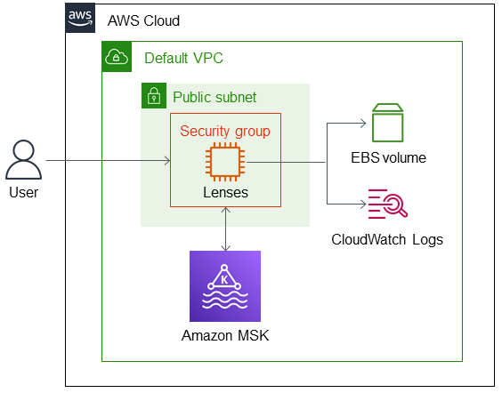

:xrefstyle: short

Deploying this Quick Start builds the following Lenses environment in the AWS Cloud.

:xrefstyle: short
[#architecture1]
.Quick Start architecture for Lenses on Amazon EC2 for Amazon MSK

As shown in <<architecture1>>, this Quick Start sets up the following:

* A virtual private cloud (VPC) configured with a public subnet, according to AWS best practices, to provide you with your own virtual network on AWS.
In the public subnet:
** Lenses deployed on an EC2 instance.
** A security group to control access to the Lenses EC2 instance.
* Amazon MSK to provision and manage an Apache Kafka cluster.
* If the local storage option is chosen during deployment, an Amazon Elastic Block Store (Amazon EBS) volume is provisioned for storage.
* (Optional) If Amazon CloudWatch metrics is chosen during deployment, Amazon CloudWatch Logs is deployed to collect and retain metrics on the Lenses EC2 instance.