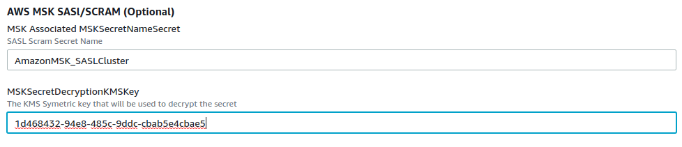

// We need to work around Step numbers here if we are going to potentially exclude the AMI subscription
=== Sign in to your AWS account

. Sign in to your AWS account at https://aws.amazon.com with an IAM user role that has the necessary permissions. For details, see link:#_planning_the_deployment[Planning the deployment] earlier in this guide.
. Make sure that your AWS account is configured correctly, as discussed in the link:#_technical_requirements[Technical requirements] section.

// Optional based on Marketplace listing. Not to be edited
ifdef::marketplace_subscription[]
=== Subscribe to the {partner-product-short-name} AMI

This Quick Start requires a subscription to the AMI for {partner-product-short-name} in AWS Marketplace.

. Sign in to your AWS account.
. Open the page for the {marketplace_listing_url}[{partner-product-short-name} AMI in AWS Marketplace^], and then choose *Continue to Subscribe*.
. Review the terms and conditions for software usage, and then choose *Accept Terms*. +
  A confirmation page loads, and an email confirmation is sent to the account owner. For detailed subscription instructions, see the https://aws.amazon.com/marketplace/help/200799470[AWS Marketplace documentation^].

. When the subscription process is complete, exit out of AWS Marketplace without further action. *Do not* provision the software from AWS Marketplace—the Quick Start deploys the AMI for you.
endif::marketplace_subscription[]
// \Not to be edited

=== Lenses.io with Amazon MSK and local storage (EBS)
// Adapt the following warning to your Quick Start.

Each deployment takes about {deployment_time} to complete.

. Create an Amazon MSK cluster without Authentication and enable Open Monitoring

. Subscribe to the marketplace

. Check the AWS Region that’s displayed in the upper-right corner of the navigation bar, and change it if necessary. This Region is where the network infrastructure for {partner-product-short-name} is built. The template is launched in the {default_deployment_region} Region by default. For other choices, see link:#_supported_regions[Supported Regions] earlier in this guide.

[start=2]
. Choose cloudformation to launch the AWS CloudFormation template as in <<marketplace1>>

:xrefstyle: short
[#marketplace1]
.Launch CloudFormation in Marketplace
[link=images/marketplace_launch.png]

[start=3]
. On the *Create stack* page, keep the default setting for the template URL, and then choose *Next*.
. On the *Specify stack details* page, change the stack name if needed. 
. Review the parameters for the template. Provide values for the parameters that requires input

:xrefstyle: short
[#lensesiomsk]
.Example values for cloudformation parameters
[link=images/lensesio_msk.png]

|===
|Parameter | Description | Required

|VPC | The VPC you want to deploy Lenses.io workspace. Recommend to be the same with Amazon MSK | yes
|Subnet | The VPC subnet you want to deploy Lenses.io workspace | yes
|InstanceType | Recommended t3.large | yes
|SSHLocation | CIDR block for SSH acccess | yes
|LensesLocation | CIDR block for Lenses.io workspace acccess | yes
|AWS MSK ARN | The Amazon MSK cluster ARN | yes
|AWS MSK Security Group | The Amazon MSK cluster security Group | yes 
|===

=== Lenses.io with Amazon MSK - SASL/SCRAM and local storage (EBS)

. Create an Amazon MSK cluster with SASL/SCRAM https://docs.aws.amazon.com/msk/latest/developerguide/msk-password.html
. Follow the previous step by step for Lenses.io with Amazon MSK
. Create a Secret in Secrets manager as described here https://docs.aws.amazon.com/msk/latest/developerguide/msk-password.html#msk-password-tutorial
. Review the parameters for the template in section *AWS MSK SASl/SCRAM*

:xrefstyle: short
[#lensesiomsksasl]
.Example values for cloudformation parameters for Amazon MSK SASL/SCRAM
[link=images/lensesio_msk_sasl.png]

|===
|Parameter | Description | Required

|VPC | The VPC you want to deploy Lenses.io workspace. Recommend to be the same with Amazon MSK | yes
|Subnet | The VPC subnet you want to deploy Lenses.io workspace | yes
|InstanceType | Recommended t3.large | yes
|SSHLocation | CIDR block for SSH acccess | yes
|LensesLocation | CIDR block for Lenses.io workspace acccess | yes
|AWS MSK ARN | The Amazon MSK cluster ARN | yes
|AWS MSK Security Group | The Amazon MSK cluster security Group | yes 
|MSK Associated MSKSecretNameSecret | The name of secret you created with the prefi *AmazonMSK_* | yes
|MSKSecretDecryptionKMSKey | The KMS Symetric key that will be used to decrypt the secret| yes
|===

=== Lenses.io with Amazon MSK and Amazon RDS

. Create an Amazon RDS or use an existing one with Postgres engine
. Follow the previous step by step for Lenses.io with Amazon MSK
. Review the parameters for the template in section *Lenses Storage*. Slect *postgres* for the storage type and provide values for the parameters that requires input

:xrefstyle: short
[#lensesiords]
.Example values for cloudformation parameters for Amazon RDS with postgres engine
[link=images/lensesio_rds.png]

|===
|Parameter | Description | Required

|VPC | The VPC you want to deploy Lenses.io workspace. Recommend to be the same with Amazon MSK | yes
|Subnet | The VPC subnet you want to deploy Lenses.io workspace | yes
|InstanceType | Recommended t3.large | yes
|SSHLocation | CIDR block for SSH acccess | yes
|LensesLocation | CIDR block for Lenses.io workspace acccess | yes
|AWS MSK ARN | The Amazon MSK cluster ARN | yes
|AWS MSK Security Group | The Amazon MSK cluster security Group | yes 
|PostgresHostname | The RDS Endpoint | yes
|PostgresUsername | The RDS username to connect | yes
|PostgresPassword | The RDS password to connect | yes
|PostgresDatabase | The RDS database to connect and create the schemas. Needs to be already created in the RDS | yes
|===

=== Lenses.io metrics to CloudWatch

Lenses.io exposes in an endpoint metrics in order to be able to monitor the workspace. If you select *yes*
then the metrics will be exposed in CloudWatch periodically.

:xrefstyle: short
[#lensesiomonitoring]
.Example values for cloudformation parameters for Amazon MSK SASL/SCRAM
[link=images/lensesio_monitoring.png]

:xrefstyle: short
[#lensesiocloudwatch]
.Example of Cloudwatch metrics
[link=images/lensesio_cloudwatch_lags.png]
